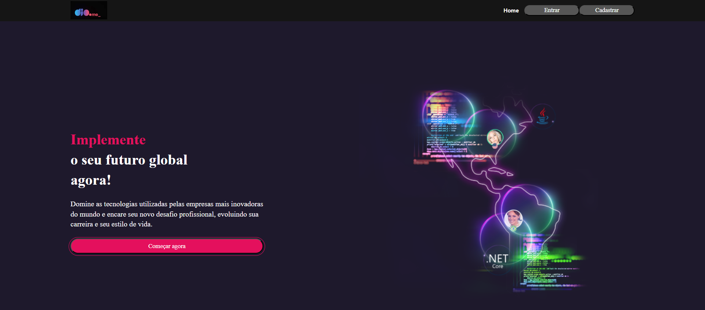
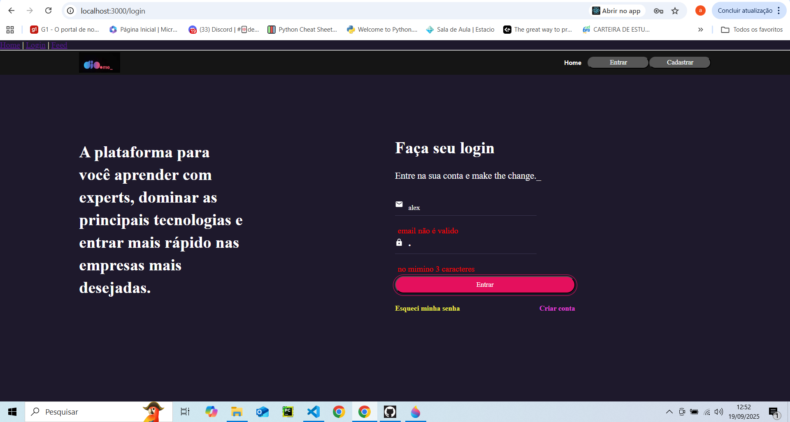
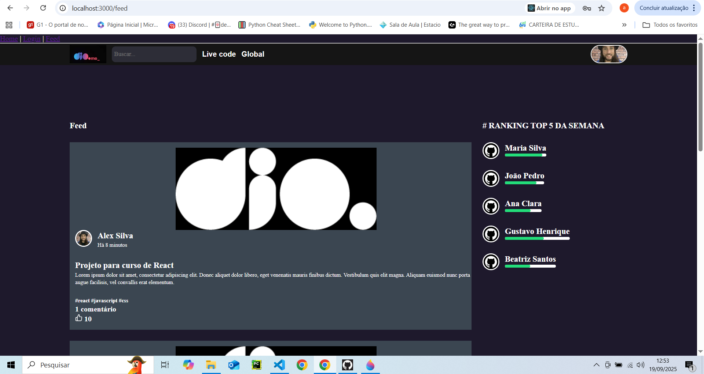

# 🚀 Projeto React - Desenvolvendo a Tela de Cadastro da Plataforma Dio com React

Este projeto foi desenvolvido em **React** com foco em simular uma plataforma de aprendizado com autenticação e feed de conteúdo.

## 📌 Funcionalidades

* **Home**: Página inicial com informações sobre a plataforma e chamada para ação.
* **Login**: Página de autenticação de usuário.
* **Feed**: Página com cards de conteúdo e ranking dos 5 usuários mais ativos da semana.

## 🛠️ Tecnologias Utilizadas

* [React](https://reactjs.org/)
* [React Router DOM](https://reactrouter.com/)
* [Styled Components](https://styled-components.com/)
* [Axios](https://axios-http.com/) (para chamadas HTTP)
* [JSON Server](https://github.com/typicode/json-server) (simulação de API)

## 📂 Estrutura do Projeto

```
src/
  ├── assets/          # Imagens e ícones
  ├── components/      # Componentes reutilizáveis (Header, Button, Card, UserInfo)
  ├── pages/           # Páginas principais (Home, Login, Feed)
  ├── styles/          # Estilos globais e temas
  └── App.jsx          # Definição das rotas
```

## ⚡ Rotas da Aplicação

* `/` → Página **Home**
* `/login` → Página **Login**
* `/feed` → Página **Feed**

## ▶️ Como Rodar o Projeto

Clone o repositório:

```bash
git clone https://github.com/alexsilvaribeiro/trilha-react-desafio-3.git
```

Entre na pasta do projeto:

```bash
cd nome-do-projeto
```

Instale as dependências:

```bash
npm install
```

Inicie o servidor:

```bash
npm start
```

(Opcional) Para rodar a API fake com JSON Server:

```bash
npx json-server --watch db.json --port 3001
```

## 📸 Exemplo de Uso

### Página principal



### Página de login



### Página de feed

## 

👤 Autor: [@alexsilvaribeiro](https://github.com/alexsilvaribeiro)
